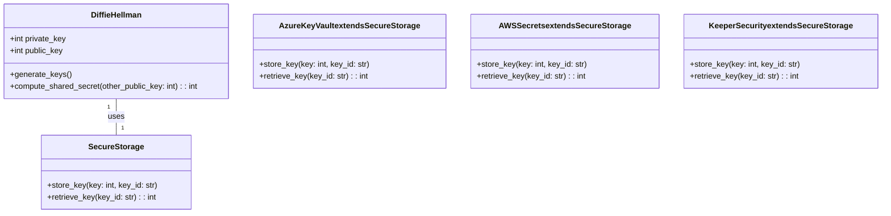
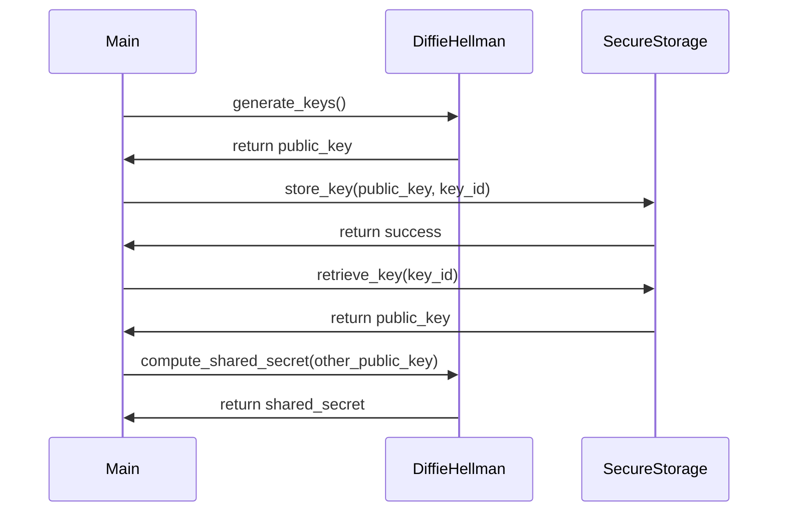

## Implementation approach
The system will be implemented using Python 3.8 or later. We will use the pycryptodome library for the Diffie-Hellman key exchange protocol, and azure.identity for Azure Key Vault integration. For AWS Secrets, we'll use boto3, and for Keeper Security, we'll use the keepercommander library. For testing, we'll use pytest and unittest libraries. The system will be divided into three main parts: the Diffie-Hellman protocol implementation, the secure storage services integration, and the tests.

## Python package name
```python
"secure_key_exchange"
```

## File list
```python
[
    "main.py",
    "diffie_hellman.py",
    "secure_storage.py",
    "tests.py"
]
```

## Data structures and interface definitions


## Program call flow


## Anything UNCLEAR
The requirement is clear. However, the choice of secure storage service (AWS Secrets, Azure Key Vault, or Keeper Security) should be made based on the specific needs and constraints of the project.